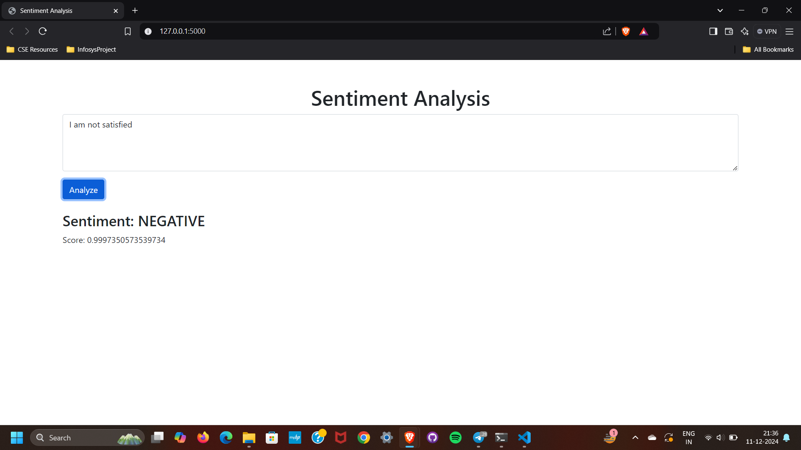
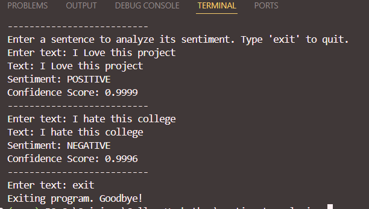

# Sentiment Analysis Application

This project is a **Sentiment Analysis Application** built using Python and AWS services. It takes text input from the user and analyzes the sentiment of the text (positive, negative, or neutral). The application uses a **Large Language Model (LLM)** for sentiment analysis and integrates with **AWS DynamoDB** for storing the results and **S3 bucket** for storing logs.

## Features

- Text input for sentiment analysis.
- Displays sentiment results (positive, negative, or neutral).
- Stores the analysis results in AWS DynamoDB.
- Logs are stored in an AWS S3 bucket.
- Simple and user-friendly interface.

## Requirements

### Frontend
- HTML, CSS, and JavaScript (for UI)
- jQuery for AJAX requests

### Backend
- Python 3.x
- Flask for API development
- AWS SDK (boto3) for AWS integration
- **AWS DynamoDB** for storing results
- **AWS S3** for storing logs

### Libraries
- Flask
- boto3
- requests
- json

### Set Up

#### 1. Clone the repository:

```bash
git clone https://github.com/Srinivas2206/sentiment-analysis-app.git
cd sentiment-analysis-app
```
### 2. Install required Python libraries:

```bash
pip install -r requirements.txt
```

### 3. Set up AWS credentials:
Make sure you have your AWS credentials configured for the application to interact with AWS services.
```bash
aws configure
```

### 4. Configure and deploy the project:
Create an S3 bucket for storing logs.
Set up a DynamoDB table to store sentiment results.

### 5. Run the application:
```bash
python app.py
```
Visit http://127.0.0.1:5000 in your browser to access the application.

## AWS Setup
1. DynamoDB:
Create a table in DynamoDB for storing sentiment analysis results. Example table name: SentimentAnalysisResults.
The primary key can be id (String) or timestamp.
2. S3 Bucket:
Create an S3 bucket to store logs and any other necessary data.
Set appropriate permissions and policies for the bucket.
3. IAM Roles & Permissions:
Make sure that the appropriate IAM roles and policies are configured for accessing DynamoDB and S3.


### Screenshots





Contributing
Feel free to fork the repository and submit pull requests for any changes or improvements. Please make sure to update the documentation as needed.
